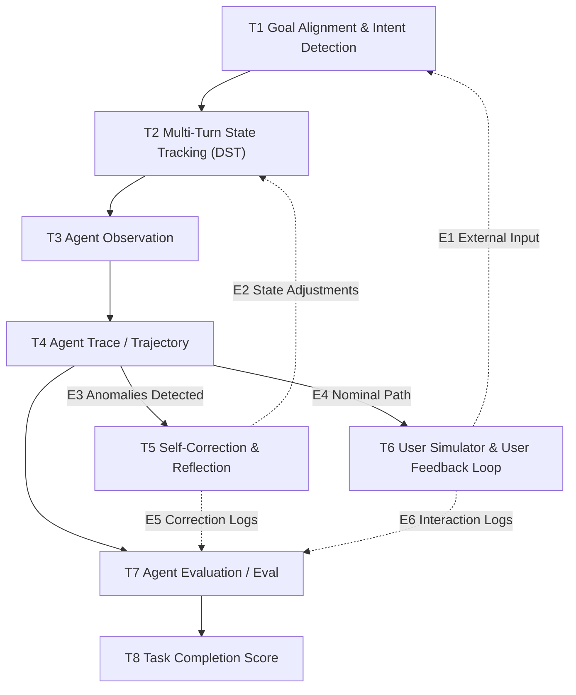

### 資料流

八個節點與六條邊（依 `data/topics.json`），圖照 demian 提供的框架圖畫：實線是主幹與分支，虛線是回饋邊。T3 與 T8 不是六條邊的端點。

E1（T6→T1）使用者輸入進入目標對齊；E2（T5→T2）修正結果寫回狀態；E3（T4→T5）偵測到異常觸發修正；E4（T4→T6）正常路徑繼續互動；E5（T5→T7）修正紀錄回流評估；E6（T6→T7）互動紀錄回流評估。這張圖只是地圖，不代表有論文驗過整條線（見第 6 節）。

**主幹的五條箭頭沒有論文當邊研究過，契約是推論。** 圖上實線的主幹（T1→T2、T2→T3、T3→T4、T4→T7、T7→T8）不在調研一開始定義的六條邊裡，所以第 5 節在 E1–E6 之後另寫了 M1–M5 五條契約，欄位全部是從相鄰的卡推出來的，等級 C。各箭頭有多少現成的依據：

| 箭頭 | 編號 | 直接以它為題的卡 | 依據的厚薄 |
| --- | --- | --- | --- |
| T1→T2 | M1 | T1-10（C，推論：把推斷出的目標寫成顯式交接物） | 一張卡；T2 沒有任何一張卡以「從 T1 接什麼」為題 |
| T2→T3 | M2 | 沒有 | 最薄；只有 T2、T3 各自的卡拼起來，兩個待決題（T2-04、T3-02）會改變它 |
| T3→T4 | M3 | 沒有；最接近的是 T4-08（待決：軌跡用什麼格式記錄）與 E3 的 T3 生產端 | 薄；欄位拼自 T3-01、T3-09 與 E3 |
| T4→T7 | M4 | T7-10（C，推論：評估端要持續讀取的紀錄最少要包含什麼） | 最厚；另有 T7-08（A）、T7-09（B）與 E5、E6 的消費端，也是唯一有可執行驗收的一條 |
| T7→T8 | M5 | 沒有；T8 的卡談分數怎麼定義、聚合與報告，T7-06 談跑幾次與區間 | 中；欄位拼自 T7、T8 的 A、B 級量測卡，但「T7 交給 T8 什麼」沒有卡寫成介面 |

**這張圖與整份方案涵蓋的是自我進化之前的底座**：觀測、軌跡、當場修正（T5 只改這一場對話的狀態）、使用者模擬、評估與計分。T7、T8 的輸出只通到分數，沒有任何箭頭回到 agent 去改提示詞、記憶、工具或權重，所以「量到→提出改動→驗證改動→收進去」這個閉環不在範圍內；讀過的論文也沒有人驗過這種端到端閉環（README〈整個框架的未解問題〉第 2 題）。第 3 節的量測規則可以當作那個閉環的準入條件，但這一句是推論，沒有論文驗過。
